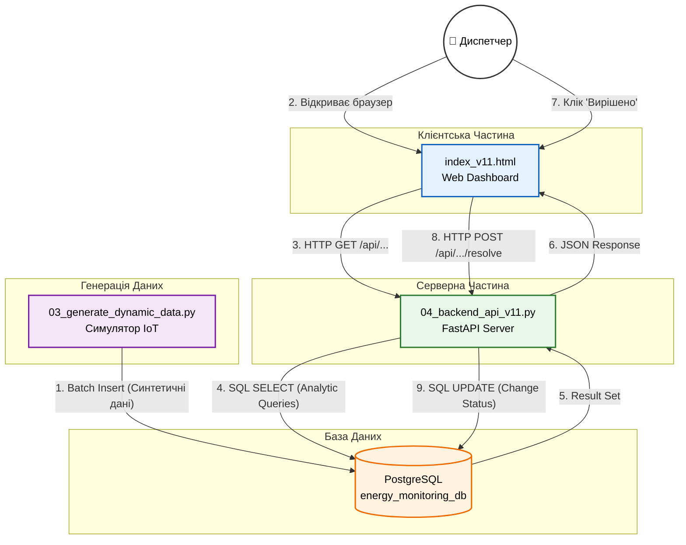

# 🏗️ Архітектура Коду та Технічна Реалізація

Цей документ містить детальний технічний опис системи моніторингу енергосистеми (v11.0). Тут розкрито внутрішню логіку компонентів, обґрунтування вибору технологій та опис алгоритмів, використаних у проекті.

## 📂 1. Структура Проекту (File Tree)

Система побудована за модульним принципом, де кожен файл відповідає за конкретний шар архітектури:

* **`01_create_schema_v3.sql`** — **(Database DDL)** Скрипт створення структури бази даних (таблиці, зв'язки, індекси). Це "скелет" системи.
* **`02_insert_static_data_v2.sql`** — **(Database DML)** Скрипт наповнення "довідників" (статична топологія: міста, координати підстанцій, характеристики ліній).
* **`03_generate_dynamic_data.py`** — **(Simulation / ETL)** Python-скрипт, що виступає в ролі емулятора IoT-системи. Генерує часові ряди та події.
* **`04_backend_api_v11.py`** — **(Backend / Business Logic)** API-сервер на базі FastAPI. Обробляє запити від клієнта, виконує аналітику та керує станом системи.
* **`index_v11.html`** — **(Frontend / Presentation)** Клієнтський SPA (Single Page Application) дашборд для візуалізації даних.
* **`requirements.txt`** — Список залежностей (бібліотек) для розгортання середовища Python.


### Детальний розбір схеми (`01_create_schema.sql`)

Цей файл містить DDL (Data Definition Language) інструкції, які визначають структуру "фундаменту" системи.

#### 1\. Очищення середовища (Clean Slate)

```sql
DROP TABLE IF EXISTS EnergyPricing;
...
DROP TABLE IF EXISTS Regions;
```

  * **Що це:** Видалення старих таблиць у зворотному порядку (спочатку залежні, потім головні).
  * **Навіщо:** Це забезпечує **ідемпотентність** скрипта. Ми можемо запускати його скільки завгодно разів, щоб "скинути" базу до початкового стану без помилок конфліктів.

#### 2\. Довідники (Dimensions) — Статична структура

Це таблиці, які змінюються рідко і описують фізичну структуру мережі.

**Приклад: `Substations`**

```sql
CREATE TABLE Substations (
    substation_id INT PRIMARY KEY GENERATED BY DEFAULT AS IDENTITY,
    capacity_mw DECIMAL(10, 2) NOT NULL CHECK (capacity_mw > 0),
    latitude DECIMAL(9, 6),
    longitude DECIMAL(10, 6),
    FOREIGN KEY (region_id) REFERENCES Regions(region_id)
);
```

  * **`GENERATED BY DEFAULT AS IDENTITY`:** Сучасний стандарт SQL для автоінкременту (краще за старий `SERIAL`).
  * **`DECIMAL(10, 2)`:** Використано для потужності. Тип `FLOAT` тут не підходить через можливі похибки округлення, а `DECIMAL` гарантує точність (важливо для фінансів та інженерії).
  * **`CHECK (capacity_mw > 0)`:** Захист цілісності даних на рівні БД. Система фізично не дозволить створити підстанцію з від'ємною потужністю.
  * **`latitude/longitude`:** Додані для підтримки гео-просторового аналізу (відображення на карті Leaflet).

#### 3\. Топологія Мережі

**Приклад: `PowerLines`**

```sql
CREATE TABLE PowerLines (
    ...
    CHECK (from_substation_id <> to_substation_id)
);
```

  * **Логіка графа:** Таблиця реалізує ребра графа, де вузлами є підстанції.
  * **Constraint:** Перевірка `CHECK` гарантує, що лінія не може з'єднувати підстанцію саму з собою (петля), що є фізично неможливим.

#### 4\. Журнали Транзакцій (Facts) — OLTP навантаження

Це "найважчі" таблиці, куди постійно пишуться нові дані (Time-Series data).

**Приклад: `LoadMeasurements`**

```sql
CREATE TABLE LoadMeasurements (
    timestamp TIMESTAMPTZ NOT NULL,
    actual_load_mw DECIMAL(10, 2) NOT NULL,
    ...
);
CREATE INDEX idx_loadmeasurements_timestamp_substation
ON LoadMeasurements (substation_id, timestamp);
```

  * **`TIMESTAMPTZ`:** Використання часу з часовим поясом критично важливе для енергетики, щоб уникнути плутанини при переході на літній/зимовий час.
  * **Композитний Індекс:** Створено спеціальний індекс по двох полях (`substation_id` + `timestamp`).
      * *Ефект:* При запиті "Дай графік для підстанції X за вчора" база даних не перебирає 100,000 рядків, а миттєво знаходить потрібний блок. Це пришвидшує API у десятки разів.

#### 5\. Події та Оперативне Управління

**Приклад: `Alerts`**

```sql
CREATE TABLE Alerts (
    ...
    status VARCHAR(20) NOT NULL DEFAULT 'NEW' 
    CHECK (status IN ('NEW', 'ACKNOWLEDGED', 'RESOLVED'))
);
```

  * **State Machine (Машина станів):** Стовпець `status` перетворює таблицю з простого "логу помилок" на систему управління інцидентами (Ticket System).
  * **DEFAULT 'NEW':** При створенні аварії вона автоматично стає активною.

**Приклад: `MaintenanceEvents` (Поліморфізм)**

```sql
CREATE TABLE MaintenanceEvents (
    ...
    object_type VARCHAR(20) CHECK (object_type IN ('Підстанція', 'Лінія')),
    object_id INT NOT NULL
);
```

  * **Універсальність:** Замість створення двох таблиць (`SubstationRepairs` та `LineRepairs`), використано одну універсальну. Поле `object_type` вказує, що саме ми ремонтуємо, а `object_id` — це ID цього об'єкта.


### Файл: `02_insert_static_data_v2.sql` (DML: Наповнення Топології)

Цей скрипт відповідає за ініціалізацію **статичного шару** даних. Він наповнює таблиці-виміри (Dimensions) та формує "цифровий двійник" енергосистеми перед початком симуляції.

#### 1\. Географічна прив'язка (GIS Data)

У блоці **`INSERT INTO Substations`** ми не просто створюємо об'єкти, а жорстко задаємо їхні географічні координати.

```sql
-- Приклад з коду:
VALUES (10, 'ПС Північна', ..., 50.450100, 30.523400)
```

  * **Технічне рішення:** Використано реальні координати обласних центрів України (Київ, Харків, Львів, Одеса).
  * **Призначення:** Ці дані (`latitude`, `longitude`) використовуються на фронтенді бібліотекою **Leaflet.js** для рендерингу маркерів на карті без необхідності звертатися до зовнішніх сервісів геокодування.

#### 2\. Побудова Графа Мережі (Topology)

У блоці **`INSERT INTO PowerLines`** визначаються фізичні зв'язки між вузлами.

```sql
-- Приклад з коду:
VALUES (104, 'Київ-Харків', ..., 10, 14) -- з'єднує ID 10 та ID 14
```

  * **Логіка:** Цей блок формує список ребер (Edges) для графа.
  * **Вплив:** Бекенд (`/api/v6/network/status`) зчитує ці пари ID, щоб побудувати топологічну схему для візуалізації у **Vis.js** та ліній на карті.

#### 3\. Детерміновані Первинні Ключі

При вставці даних ми явно вказуємо ID, ігноруючи автоінкремент:

```sql
-- Ми пишемо (10, ...), а не (DEFAULT, ...)
VALUES (10, 'ПС Північна'...)
```

  * **Обґрунтування:** Це гарантує **посилальну цілісність** (Referential Integrity) при розгортанні проекту на новій машині. Ми точно знаємо, що лінія "Київ-Бровари" завжди з'єднуватиме ID `10` і `11`, незалежно від того, скільки разів перестворювалася база.

#### 4\. Категоризація для BI-аналітики

У блоках **`INSERT INTO Generators`** та **`INSERT INTO Consumers`** створено репрезентативну вибірку типів.

```sql
-- Приклади:
('solar', ...), ('wind', ...), ('hydro', ...) -- для генераторів
('промисловий', ...), ('побутовий', ...)     -- для споживачів
```

  * **Призначення:** Це забезпечує різноманітність даних для аналітичних діаграм (Sankey, Pie Chart). Якби всі генератори були `thermal`, діаграми були б неінформативними.

#### 5\. Календарне Планування

Блок **`INSERT INTO MaintenanceEvents`** ініціалізує таблицю подій майбутніми датами.

```sql
VALUES ('2025-11-20...', 12, 'Підстанція'...)
```

  * **Призначення:** Це дозволяє продемонструвати функціонал "Календаря ремонтів" на фронтенді одразу після запуску системи, без необхідності чекати, поки симулятор згенерує події.


### Файл: `03_generate_dynamic_data.py` (ETL & Simulation)

Цей Python-скрипт виконує роль **генератора синтетичних даних**. Він імітує роботу реальної системи моніторингу, створюючи тисячі записів телеметрії на основі заданих правил та математичних моделей.

#### 1\. Конфігурація та Безпека

```python
from dotenv import load_dotenv
load_dotenv()
DB_CONFIG = { ... os.getenv("DB_NAME") ... }
```

  * **Змінні оточення:** Використання `python-dotenv` дозволяє зберігати паролі у прихованому файлі `.env`, не "зашиваючи" їх у код. Це стандарт безпечної розробки.
  * **Параметри симуляції:** Константи `START_DATE`, `END_DATE`, `TIME_STEP` дозволяють легко змінювати період (тиждень, місяць, рік) та частоту дискретизації даних (15 хв, 1 година).

#### 2\. Підготовка Даних (Extract)

Функція `fetch_static_data` спочатку зчитує з БД **статичні довідники** (підстанції, генератори). Симулятор повинен знати *для кого* він генерує дані (наприклад, "для підстанції ID=10 з лімітом 750 МВт").

#### 3\. Математичне Моделювання (Transform)

Це "серце" симуляції. Замість повністю випадкових чисел (`random`), ми використовуємо **детерміновані алгоритми**, щоб графіки виглядали реалістично.

**А. Модель Погоди (`get_weather`)**

```python
temp_base = 10 + 5 * np.sin(...) # Сезонна хвиля
temp_daily = -3 * np.sin(...)    # Добова хвиля
```

  * Використано суперпозицію двох синусоїд: одна імітує зміну пори року (зима/літо), інша — зміну часу доби (день/ніч). Це створює плавну криву температури.

**Б. Модель Навантаження (`get_load`)**

```python
total_load = base_load + daily_pattern + weather_effect + noise
```

Навантаження підстанції розраховується як сума чотирьох факторів:

1.  **Base Load:** Мінімальне постійне споживання (30% від потужності).
2.  **Daily Pattern:** Синусоїда, що імітує активність людей (пік вдень/ввечері).
3.  **Weather Effect:** Логіка "якщо холодно (\<5°C) — вмикаємо обігрівачі", "якщо жарко (\>22°C) — кондиціонери".
4.  **Noise:** Невеликий випадковий шум, щоб дані не виглядали штучно гладкими.

**В. Детекція Аварій**

```python
if random.random() < 0.001: # 0.1% шанс
    total_load = capacity * random.uniform(1.05, 1.2) # Перевантаження
```

Скрипт іноді "ламає" систему, генеруючи стрибок навантаження вище ліміту. Це автоматично створює запис у таблиці `Alerts`.

#### 4\. Оптимізація Запису (Load)

```python
execute_values(cursor, "INSERT INTO ... VALUES %s", generated_weather)
```

  * **Проблема:** Класичний цикл `for row in data: cursor.execute("INSERT...")` працює дуже повільно (100 000 запитів до БД).
  * **Рішення:** Використано метод **`execute_values`** (Batch Insert). Всі дані збираються у великі списки в пам'яті Python, а потім відправляються в PostgreSQL **одним пакетом**. Це прискорює процес генерації з кількох хвилин до кількох секунд.


### Файл: `04_backend_api_v11.py` (Backend API Layer)

Цей файл є сервером, побудованим на **FastAPI**. Він виступає в ролі **ROLAP-процесора** (Relational OLAP) та **контролера** оперативного дашборду.

#### 1\. Налаштування (Блок `app = FastAPI(...)`)

```python
app = FastAPI(...)

app.add_middleware(
    CORSMiddleware,
    allow_origins=["*"],
    ...
    allow_methods=["*"], # Дозволяємо POST
)
```

  * **`FastAPI`**: Обрано через високу продуктивність (завдяки `async`) та автоматичну генерацію документації.
  * **`CORSMiddleware`**: Це критично важливий елемент безпеки. Оскільки наш "мозок" (на `port:8000`) та "вітрина" (на `port:8001`) знаходяться на різних портах, браузер заблокував би їхнє спілкування. Цей код (`allow_origins=["*"]`) дає "дозвіл" на таке спілкування.
  * **`allow_methods=["*"]`**: Ми додаємо сюди `POST`, `PUT`, `DELETE` (а не тільки `GET`), щоб дозволити нашій кнопці "Вирішено" змінювати дані в базі.

#### 2\. Безпека Конфігурації (Блок `DB_CONFIG`)

```python
load_dotenv()
DB_CONFIG = {
    "dbname": os.getenv("DB_NAME"),
    "password": os.getenv("DB_PASSWORD"),
    ...
}
```

  * **`load_dotenv()`**: Замість того, щоб "зашивати" пароль (`12905639`) у код, ми завантажуємо його з прихованого файлу `.env`. Це професійний стандарт, який запобігає витоку секретних даних на GitHub.

#### 3\. Допоміжні функції (Utilities)

**А. `get_db_connection()`**

  * Ця функція інкапсулює логіку підключення до PostgreSQL, щоб не дублювати її у кожному API-запиті.

**Б. `convert_decimals(data)`**

  * **Критична функція.** Python отримує дані з PostgreSQL у спеціальних типах (`Decimal`, `datetime`). JSON (мова спілкування "мозку" та "вітрини") **не розуміє** ці типи.
  * Ця функція примусово конвертує `Decimal` у `float` (число) та `datetime` у `string` (рядок ISO), щоб JSON міг їх обробити.

#### 4\. Оперативний Модуль (v11: "Actionable Alerts")

Це функції, які роблять дашборд інтерактивним.

**А. `get_active_alerts()`**

```python
@app.get("/api/v11/alerts/active")
...
SELECT ... FROM Alerts a ... WHERE a.status = 'NEW'
```

  * **Логіка:** Це `GET`-запит, який повертає **не всі** тривоги, а лише ті, що мають `status = 'NEW'`. Це реалізує логіку "списку активних завдань" для диспетчера.
  * **`cursor_factory=RealDictCursor`**: Ключова оптимізація. Вона змушує `psycopg2` повертати дані не як кортеж `(1, 'Київ')`, а як JSON-сумісний словник `{'id': 1, 'name': 'Київ'}`.

**Б. `resolve_alert(alert_id: int)`**

```python
@app.post("/api/v11/alerts/{alert_id}/resolve")
...
UPDATE Alerts SET status = 'RESOLVED' WHERE alert_id = %s
...
conn.commit()
```

  * **`@app.post`**: Це **`POST`-запит**, оскільки він **змінює** дані на сервері.
  * **`alert_id: int`**: FastAPI автоматично валідує вхідні дані (якщо хтось спробує надіслати `.../resolve/abc`, сервер видасть помилку 422).
  * **`UPDATE ... SET status = 'RESOLVED'`**: Виконує бізнес-логіку "закриття" аварії.
  * **`conn.commit()`**: **Критичний рядок.** Без `commit()` зміни не будуть збережені в базі даних після завершення запиту.
  * **`conn.rollback()`**: Якщо під час оновлення станеться помилка, `rollback()` гарантує, що база даних повернеться до попереднього стану.

#### 5\. Аналітичні Модулі (ROLAP)

Це функції, які виконують складні, "важкі" SQL-запити для побудови графіків.

**А. `get_sankey_data_plotly()` та `get_heatmap_data()`**

```python
@app.get("/api/v10/analysis/sankey")
...
SELECT 'Г: ' || g.generator_type AS "from", ...
```

  * **Логіка:** Ці функції виконують **Трансформацію (T з ETL)**. Вони роблять `JOIN` між кількома таблицями (напр., `Generators`, `Regions`, `GenerationMeasurements`) і агрегують дані (`GROUP BY`), щоб підготувати їх для специфічного формату, який вимагає `Plotly.js`.

**Б. `get_full_network_map_data()`**

```sql
WITH LatestLoads AS (SELECT DISTINCT ON (substation_id) ... ORDER BY ... timestamp DESC)
```

  * **Технічне рішення:** Використано **`DISTINCT ON`** (специфічна функція PostgreSQL). Це надзвичайно швидкий спосіб отримати **"тільки останній запис"** для кожної підстанції, що необхідно для "живої" карти.

**В. `get_live_forecast_fast()`**

```sql
WITH LatestTime AS (...), History AS (...), TypicalDay AS (...), ForecastWindow AS (...)
SELECT ... FROM ForecastWindow fw JOIN TypicalDay td ...
```

  * **Ключова Оптимізація:** Це **найрозумніший** запит у проекті. Замість того, щоб завантажувати 7 днів даних у Python і там їх аналізувати (що було повільно), вся логіка прогнозування (пошук "типового" дня та накладання його на майбутню сітку часу) реалізована **безпосередньо в SQL** за допомогою `CTE` (Common Table Expressions). Це дозволило перенести обчислення з "мозку" на "фундамент" і скоротити час відповіді з \>30 секунд до \<100 мілісекунд.


### Файл: `index_v11.html` (Frontend / Presentation Layer)

Цей файл є **SPA (Single Page Application)**, реалізованим на чистому JavaScript (Vanilla JS). Він відповідає за відображення даних користувачеві.

#### 1\. Структура та Стилі (HTML/CSS)

  * **CSS Grid Layout (`.dashboard-grid`):**
    ```css
    display: grid;
    grid-template-columns: repeat(auto-fit, minmax(350px, 1fr));
    ```
      * Використано сучасну технологію `CSS Grid` для створення адаптивної "плитки". Дашборд автоматично підлаштовується під розмір екрана (на телефоні — 1 колонка, на великому моніторі — 3 колонки).
  * **Chart Containers:** Кожен графік загорнутий у `div` з класом `.chart-box`. Це забезпечує уніфікований стиль (тіні, відступи, заокруглені кути).

#### 2\. Бібліотеки Візуалізації (External Libraries)

Ми підключаємо через CDN найкращі інструменти для кожного типу даних:

  * **Leaflet.js:** Для відображення карти (`#geo-network-map`). Легша за Google Maps і безкоштовна.
  * **Plotly.js:** Для складних наукових візуалізацій (Sankey, Heatmap), де потрібна точність.
  * **Chart.js:** Для швидких лінійних графіків та діаграм (Pie, Bar, Line).
  * **Vis.js:** Для відображення топології мережі у вигляді графа.

#### 3\. Логіка Клієнта (JavaScript)

Код організовано у вигляді окремих асинхронних функцій (`async function`), кожна з яких відповідає за один віджет на дашборді.

**А. Ініціалізація (`DOMContentLoaded`)**

```javascript
document.addEventListener('DOMContentLoaded', () => { ... });
```

  * При завантаженні сторінки запускається паралельне виконання всіх функцій `fetch...()`. Це гарантує, що інтерфейс не блокується, поки дані завантажуються.

**Б. Інтерактивність (Функція `resolveAlert`)**

```javascript
async function resolveAlert(alertId) {
    await fetch(..., { method: 'POST' });
    fetchAlerts(); // Оновлення таблиці
}
```

  * Це ключова функція, яка перетворює дашборд на панель керування.
  * Вона відправляє команду на сервер (`POST`), а після успішного виконання **перезавантажує** список тривог (`fetchAlerts()`), щоб користувач миттєво побачив результат своєї дії (зникнення аварії).

**В. Гео-візуалізація (`fetchAndDrawGeoNetwork`)**

```javascript
const map = L.map('geo-network-map')...
L.circle(...) // Малює вузли
L.polyline(...) // Малює лінії
```

  * Функція отримує список вузлів та ліній з API.
  * Використовує функцію `getHeatColor(percent)`, щоб динамічно розфарбувати елементи мережі (зелений -\> жовтий -\> червоний) залежно від навантаження.

**Г. Глибинна Аналітика (`fetchSankeyChart_Plotly`, `fetchHeatmapChart_Plotly`)**

  * Використовує бібліотеку **Plotly**, оскільки вона найкраще справляється з рендерингом матриць (Heatmap) та потокових діаграм (Sankey).
  * *Особливість:* Дані для цих графіків попередньо готуються на бекенді (`v10` API), тому фронтенд отримує вже готову структуру для малювання.

**Д. Прогнозування (`fetchForecastDashboard`)**

  * Будує комбінований графік:
      * Суцільна лінія: Історичні дані (минуле).
      * Пунктирна лінія (`borderDash: [10, 10]`): Прогноз (майбутнє).
      * Це візуально розділяє факт і прогноз для користувача.
  
