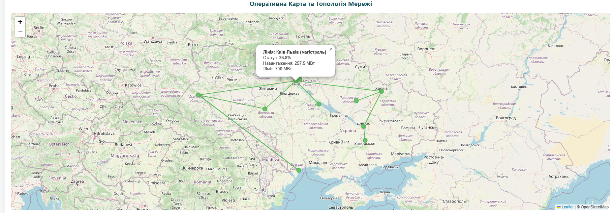
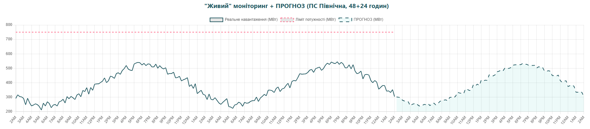
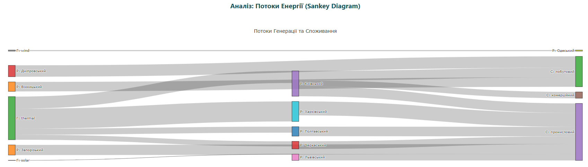
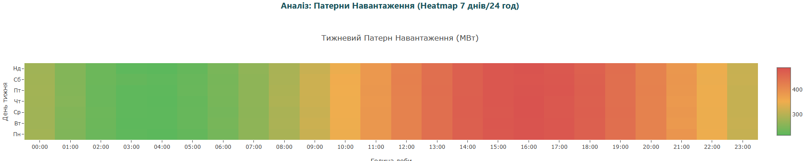
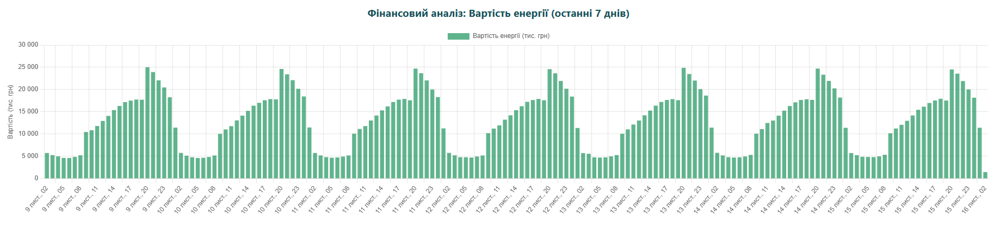
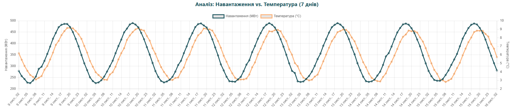
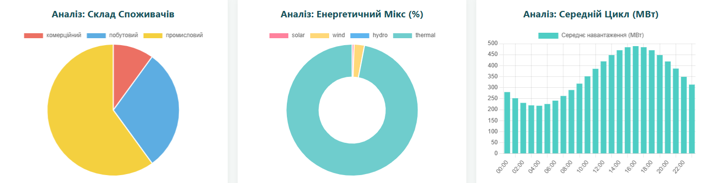
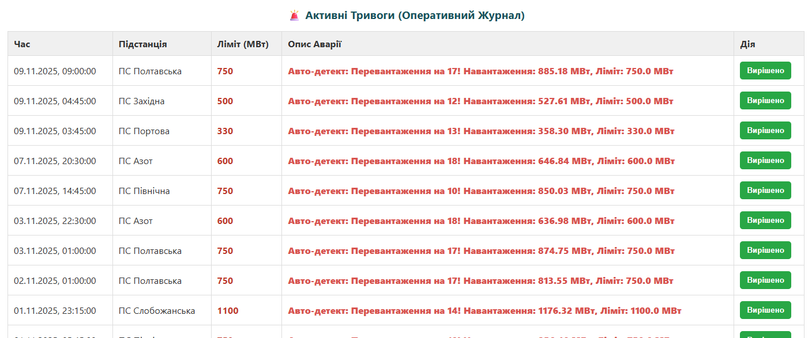
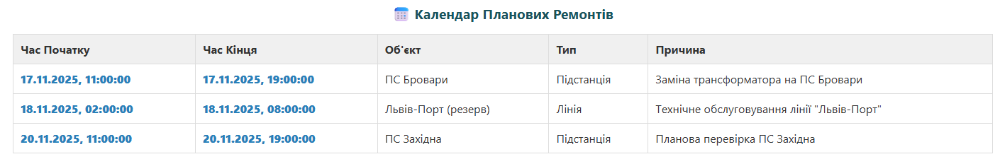

# Програмний комплекс моніторингу та інтелектуального аналізу станів енергосистеми (v11.0)

## Анотація
Даний проект представляє собою реалізацію повнофункціональної (Full-Stack) інформаційно-аналітичної системи, призначеної для збору, обробки, зберігання та візуалізації телеметричних даних енергетичної мережі. Система поєднує механізми транзакційної обробки даних (OLTP) з інструментами бізнес-аналітики (BI), забезпечуючи підтримку прийняття рішень диспетчерським персоналом.

## 1. Архітектура Системи

Система побудована за трирівневою архітектурою:
1.  **Рівень Даних (Data Layer):** Реляційна база даних PostgreSQL, спроектована для зберігання нормативно-довідкової інформації (НДІ) та часових рядів вимірювань.
2.  **Рівень Логіки (Application Layer):** RESTful API сервер на базі Python (FastAPI), що забезпечує обробку запитів, агрегацію даних та виконання математичного моделювання.
3.  **Рівень Представлення (Presentation Layer):** Веб-інтерфейс для візуалізації даних у реальному часі з використанням спеціалізованих графічних бібліотек.

---

## 2. Функціональні Модулі

### 2.1. Геопросторовий та Топологічний Аналіз
Візуалізація топології електричної мережі з прив'язкою до географічних координат.
* **Компоненти:** Вузли (підстанції) та ребра (лінії електропередач).
* **Індикація:** Динамічна зміна кольору та товщини об'єктів залежно від коефіцієнта завантаження ($K_{load} = P_{actual} / P_{max}$).


### 2.2. Прогнозування та Предиктивна Аналітика
Модуль аналізу часових рядів, що порівнює фактичне навантаження за останні 48 годин з розрахунковим прогнозом на наступні 24 години. Використовуються статистичні методи для виявлення сезонності та трендів.


### 2.3. Багатовимірний Аналіз Даних (BI)
* **Діаграма Санкі (Sankey Diagram):** Візуалізація балансу потоків енергії за ланцюгом: *Генерація $\rightarrow$ Регіональний розподіл $\rightarrow$ Тип споживача*.
* **Теплова Карта (Heatmap):** Матричний аналіз (7 днів $\times$ 24 години) для виявлення часових патернів споживання та пікових навантажень.



### 2.4. Економічний та Кореляційний Аналіз
* **Фінансовий модуль:** Розрахунок вартості спожитої електроенергії на основі динамічних тарифів (Day-Ahead Market simulation).
* **Кореляційний аналіз:** Дослідження залежності обсягів споживання від температури навколишнього середовища.



### 2.5. Статистичний Аналіз
Агрегація даних щодо структури генерації (Energy Mix), категоризації споживачів та побудова усередненого добового профілю навантаження.


### 2.6. Оперативне Диспетчерське Управління
* **Журнал Аварійних Подій:** Інтерфейс для моніторингу інцидентів (перевантаження обладнання) з можливістю зміни статусу події (квитування) через HTTP POST-запити.
* **Графік Планових Ремонтів:** Відображення розкладу технічного обслуговування елементів мережі.



---

## 3. Технологічний Стек

### Серверна частина (Backend & Data)
* **Мова програмування:** Python 3.11+
* **Фреймворк:** FastAPI (асинхронна обробка запитів)
* **СУБД:** PostgreSQL (реляційна модель)
* **Бібліотеки аналізу даних:** Pandas, NumPy (стохастична симуляція, обробка масивів)
* **ORM/Drivers:** Psycopg2

### Клієнтська частина (Frontend)
* **Базові технології:** HTML5, CSS3 (Grid/Flexbox), JavaScript (ES6+)
* **Візуалізація:**
    * *Leaflet.js:* Робота з картами OpenStreetMap.
    * *Plotly.js:* Побудова складних наукових діаграм (Sankey, Heatmap).
    * *Chart.js:* Побудова лінійних та стовпчастих графіків.
    * *Vis.js:* Візуалізація графів мереж.

---

## 4. Інструкція з Розгортання (Deployment)

### Крок 1: Ініціалізація Бази Даних
1.  Встановіть СУБД **PostgreSQL**.
2.  Створіть базу даних з ім'ям `energy_monitoring_db`.
3.  Виконайте DDL-скрипт для створення структури таблиць:
    `sql/01_create_schema_v3.sql`
4.  Заповніть довідники статичними даними:
    `sql/02_insert_static_data_v2.sql`

### Крок 2: Генерація Даних
Запустіть скрипт стохастичної симуляції для наповнення БД історичними даними (емуляція роботи системи за звітний період):
```bash
python 03_generate_dynamic_data.py
````

### Крок 3: Запуск Серверної Частини

Встановіть залежності та запустіть API-сервер:

```bash
pip install -r requirements.txt
python -m uvicorn 04_backend_api_v11:app --reload
```

*Сервер буде доступний за адресою: `http://127.0.0.1:8000`*

### Крок 4: Запуск Клієнтської Частини

Запустіть локальний веб-сервер для обслуговування статичних файлів:

```bash
python -m http.server 8001
```

*Інтерфейс системи доступний за адресою: `http://127.0.0.1:8001/index_v11.html`*

-----

## 5\. Структура Репозиторію

  * `01_create_schema_v3.sql` — Скрипт створення схеми БД (DDL).
  * `02_insert_static_data_v2.sql` — Скрипт наповнення нормативно-довідковою інформацією.
  * `03_generate_dynamic_data.py` — Модуль генерації синтетичних даних.
  * `04_backend_api_v11.py` — Основний файл додатку (API Server).
  * `index_v11.html` — Головний файл клієнтського інтерфейсу (Dashboard).
  * `requirements.txt` — Перелік необхідних бібліотек Python.

<!-- end list -->
